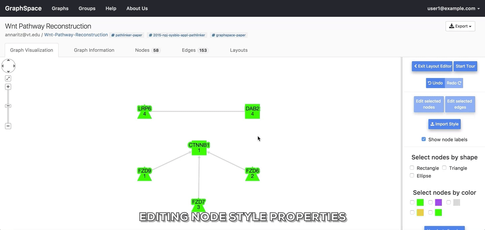
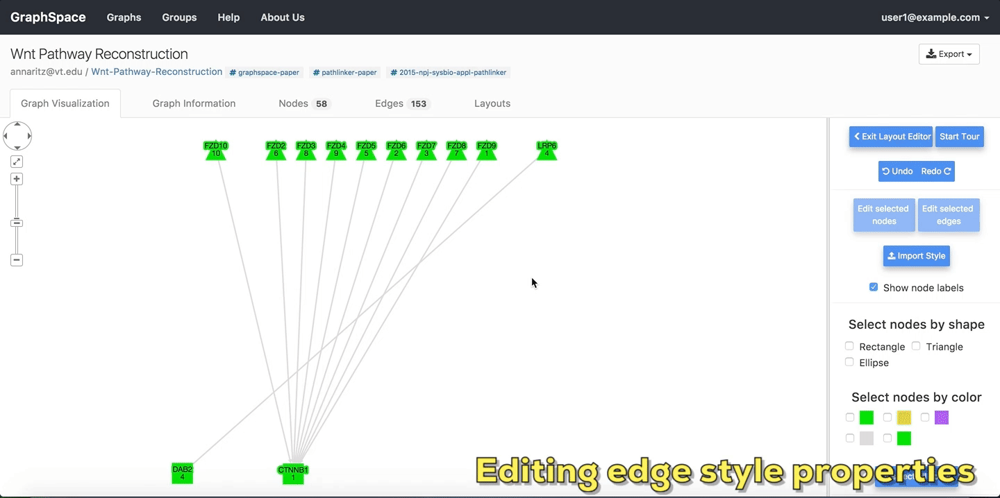

# Editing Layouts

GraphSpace includes a powerful and intuitive layout editor that allows the user to quickly select nodes with
specific properties (e.g., color and shape), to organize the selected nodes in defined shapes (e.g., a horizontal line or a filled circle), and to adjust the spacing between them. In addition, the user can manually move nodes into any configuration. The layout editor also allows users to manually change the visual properties of nodes and edges. Finally, the user can save the layout, make this layout appear by default, and share it with other viewers of the network. Only users that have access (i.e., owned or shared via a group) can manipulate a network layout.

The user can activate this functionality by clicking the `Use Layout Editor` button. 

## Start Tour 

The `Start Tour` button walks the user through all the features provided in the tool pallette. The Exit layout editor button gives a user the option to save the current layout and/or go back to the original view of the current graph. In the layout editor, the user may wield the tool pallette on the right hand side to quickly re-arrange the structure of the graph. 

## Edit selected nodes

A [GraphSpace](http://www.graphspace.org) user can change visual properties of a node by following the given steps:

1. Select one or more nodes either by [color](#select-by-color) or [shape](#select-by-shape) or using the [gestures](http://js.cytoscape.org/#notation/gestures) supported by Cytoscape.js.
2. Click on the `Edit selected nodes` button to launch the [node editor](#node-editor).
3. Change the visual properties of the selected nodes.
4. Click on `OK` if you want to save the changes else click on `Cancel` button to cancel the changes.

In the following example, the user is editing visual propeties of 'CTNNB1' node.

### Node Editor

GraphSpace that allows a user to select one or more nodes based on [color](#select-by-color) and/or [shape](#select-by-shape), and to then change their visual properties using an easy-to-use interface. The current interface allows user to change the following properties:

1. **Color**: The background color of the node.
2. **Shape**: The shape of the node's body. GraphSpace currently supports following shapes - rectangle, roundrectangle, ellipse, triangle, pentagon, hexagon, heptagon, octagon, star, diamond, vee, or rhomboid.
3. **Width**: The width of the node’s body in pixels.
4. **Height**: The height of the node’s body in pixels.
5. **Label**: The label inside of node's body. In addition to specifying the value of a property outright, the developer may also use a [mapper to dynamically specify the property value](http://js.cytoscape.org/#style/mappers). For example, data(k) would map a property to the value in an element’s `k` data-attribute. This feature can used for visualizing node annotations in the layouts.

The following image shows the visual properties of a node before and after the editing using the node editor. In this example, user has made the following changes: (i) background color from green to pink (ii) shape from rectangle to ellipse (iii) width and height from 45px to 100px (iv) label from 'CTNNB1' to 'New Label'.

<table cellspacing="0">
<tr> 
   <td class="">
      
   </td>               
   <td class="">
      
   </td> 
</tr>
<tr> 
   <th class="">
      Before editing
   </th>               
   <th class="">
      After editing
   </th> 
</tr>
</table>

When a user launches the node editor, it displays the values of style properties of the selected node if only one node is selected. Whereas if more than one node is selected, the node editor will display the values of style properties as blank. The following image shows an example of node editor when i) only one node is selected ii) more than one node is selected.

<table cellspacing="0">
<tr> 
   <td class="">
      
   </td>               
   <td class="">
      
   </td> 
</tr>
<tr> 
   <th class="">
      Node editor when only one node is selected.
   </th>               
   <th class="">
      Node editor when all nodes are selected.
   </th> 
</tr>
</table>

## Edit selected edges

A [GraphSpace](http://www.graphspace.org) user can change visual properties of an edge by following the given steps:

1. Select one or more edges either by using the [gestures](http://js.cytoscape.org/#notation/gestures) supported by Cytoscape.js.
2. Click on the `Edit selected edges` button to launch the [edge editor](#edge-editor).
3. Change the visual properties of the selected edges.
4. Click on `OK` if you want to save the changes else click on `Cancel` button to cancel the changes.

In the following example, the user is editing visual propeties of an edge between `LRP6` and `DAB2`.

### Edge Editor

GraphSpace that allows a user to select one or more edges based on [color](#select-by-color) and/or [shape](#select-by-shape), and to then change their visual/style properties using an easy-to-use interface. The current interface allows user to change the following properties:

1. **Line Color**: The colour of the edge’s line.
2. **Line Style**: The style of the edge’s line. GraphSpace currently supports following line styles - solid, dotted, or dashed.
3. **Width**: The width of an edge’s line in pixels.

The following image shows the visual properties of an edge before and after the editing using the edge editor. In this example, user has made the following changes: (i) line color from grey to red (ii) line style from solid to dashed (iii) width  from 3px to 10px.

<table cellspacing="0">
<tr> 
   <td class="">
      
   </td>               
   <td class="">
      
   </td> 
</tr>
<tr> 
   <th class="">
      Before editing
   </th>               
   <th class="">
      After editing
   </th> 
</tr>
</table>

When a user launches the edge editor, it displays the current style values of the selected node if only one edge is selected. Whereas if more than one edge is selected, the node editor will display the values of style properties as blank. 

## Show node labels

Unchecking the `Show node labels` checkbox takes a user of GraphSpace to a simplified view of the graph that hides node names.

## Select by shape

The `Select by shape` section allows the user to choose nodes in the graph based on nodes `shape` style property. For example, if a user wishes to select all nodes that are rectangles or ellipses, he/she will select both "Ellipse" and "Rectangle" in the tool pallete.

## Select by color

The `Select by color` section allows the user to choose nodes in the graph based on nodes `background-color` style property. For example, if a user wishes to select all nodes that are yellow or green, he/she will select both yellow and green.

## Unselect All Nodes

A user may click on the `Unselect All Nodes` button to reset all selections.

## Undo and Redo

The Undo and Redo buttons allow the user to undo or repeat all actions, including selection, editing and the arrange functions described below.

## Arrange nodes 

The `Arrange nodes` section allows a user to arrange all selected nodes into regions of different shapes. The following animation shows the arrangements of selected nodes that users may construct by clicking different buttons in this section.

<table cellspacing="0">
<tr> 
   <td class="">
      
   </td>               
   <td class="">
      
   </td> 
</tr>
<tr> 
   <td class="">
      
   </td>               
   <td class="">
      
   </td> 
</tr>
<tr> 
   <td class="">
      
   </td>               
   <td class="">
      
   </td> 
</tr>
<tr> 
   <td class="">
      
   </td>               
   <td class="">
      
   </td> 
</tr>
</table>

