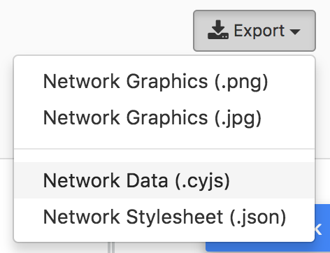
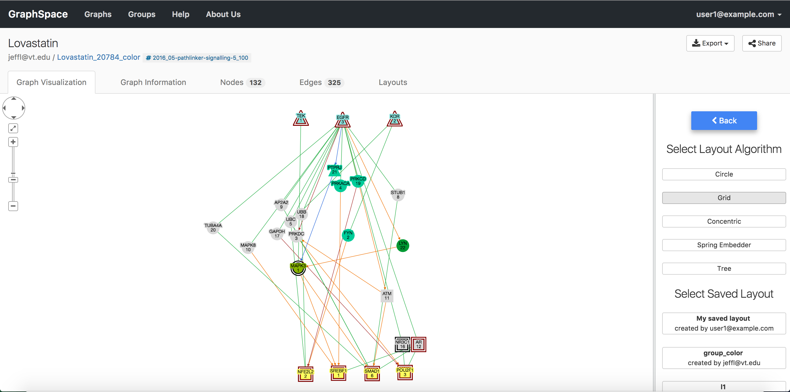
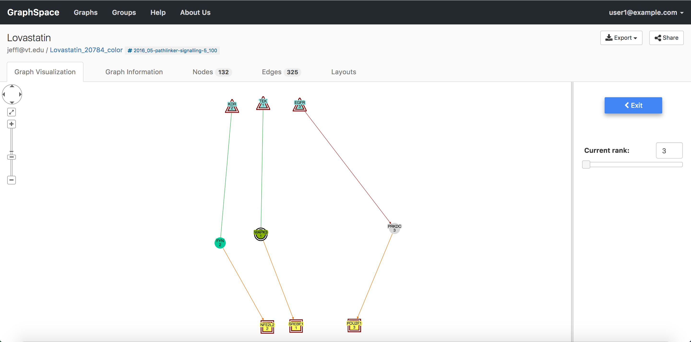

# Interacting with Graphs

GraphSpace is designed to provide access to following commonly used features:

- [Searching within a graph](#search)
- [Exporting a graph](#export)
- [Changing the graph layout](#change-layout)
- [Filtering nodes and edges](#filter-nodes-and-edges)
- [Setting default layout](#default-layout)

## Search 

This feature provides a search bar that allows the user to find nodes/edges that match search terms. See [Search Query Semantics](Searching_Graphs.html#query-semantics) section for more information on query semantics. The matching nodes or edges are [highlighted](Viewing_Graphs.html#highlighted-graph-elements) automatically as you type in the query in the search bar.

## Export 

[GraphSpace](http://www.graphspace.org) allows users to export a graph in the following formats:

1. **Network Graphics (.png)** - Export the current graph view as a PNG image.
2. **Network Graphics (.jpg)** - Export the current graph view as a JPEG image.
3. **Network Data (.png)** - Export the graph in [CYJS format](Uploading_Graphs.html#cyjs-format).
4. **Network Graphics (.png)** - Export the graph stylesheet in [Stylesheet JSON format](Uploading_Graphs.html#stylesheet-json).

GraphSpace does not support any other export formats since it relies on [Cytoscape.js](http://js.cytoscape.org) for this functionality, which implements only export to PNG, JPG and JSON format. 

## Change Layout

GraphSpace](http://www.graphspace.org) allows users to change layout using the following steps:

1. Click on the `Change Layout` button to view available layout options.
2. The `Change Layout` panel provides two alternatives:
    - **Select Layout Algorithm** - List of layout algorithms supported by GraphSpace through its use of [Cytoscape.js](http://js.cytoscape.org).
    - **Select Saved Layout** - List of layout saved by the user using GraphSpace. The user has created them in earlier sessions by manually modifying the positions of nodes and edges created by some automatic layout algorithm and saving the layout.
3. Click on a layout option to change the current layout.
 

## Filter nodes and edges

Graph algorithms may output networks where nodes and edges can be ranked, e.g., by path index or by weight/score. GraphSpace allows each node and edge to have an integer-valued data-attribute called `k` that specifies the rank of the node or the edge. For any network that contains this attribute (and only for such networks), GraphSpace displays the "Filter nodes and edges" panel with a `Current rank` slider. Changing the value in the `Current rank` slider hides all nodes and edges whose k values are less than or equal to the value in the slider. The possible values in this slider range from 1 to the maximum value of `k` in the graph. This interface element allows the user to unveil the network gradually in real time and gain intuition about how the network expands or contracts as this threshold changes.

The images below shows a user stepping through a graph using this slider. For example, changing the value from 3 to 4 revealed the green node and the edges connecting it to the blue node and yellow node.

Current Rank is 3            |  Current Rank is 4
:-------------------------:|:-------------------------:
  |  

## Default Layout

