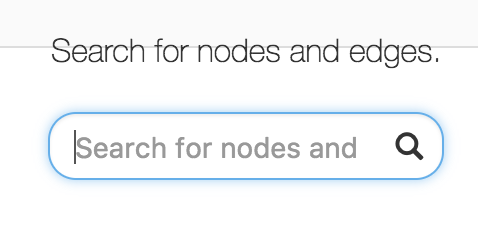

# Interacting with Graphs

GraphSpace is designed to provide access to following commonly used features:

- [Searching within a graph](#search)
- [Exporting a graph](#export)
- [Changing the graph layout](#change-layout)
- [Filtering nodes and edges](#filter-nodes-and-edges)
- [Setting default layout](#default-layout)

## Search 

This feature provides a search bar that allows the user to find nodes/edges that match search terms. See [Search Query Semantics](Searching_Graphs.html#query-semantics) section for more information on query semantics. The matching nodes or edges are [highlighted](Viewing_Graphs.html#highlighted-graph-elements) automatically as you type in the query in the search bar.

## Export 

[GraphSpace](http://www.graphspace.org) allows users to export a graph in the following formats:

1. **Network Graphics (.png)** - Export the current graph view as a PNG image.
2. **Network Graphics (.jpg)** - Export the current graph view as a JPEG image.
3. **Network Data (.png)** - Export the graph in [CYJS format](Uploading_Graphs.html#cyjs-format).
4. **Network Graphics (.png)** - Export the graph stylesheet in [Stylesheet JSON format](Uploading_Graphs.html#stylesheet-json).

GraphSpace does not support any other export formats since it relies on [Cytoscape.js](http://js.cytoscape.org) for this functionality, which implements only export to PNG, JPG and JSON format. 

## Change Layout

## Filter nodes and edges

## Default Layout

