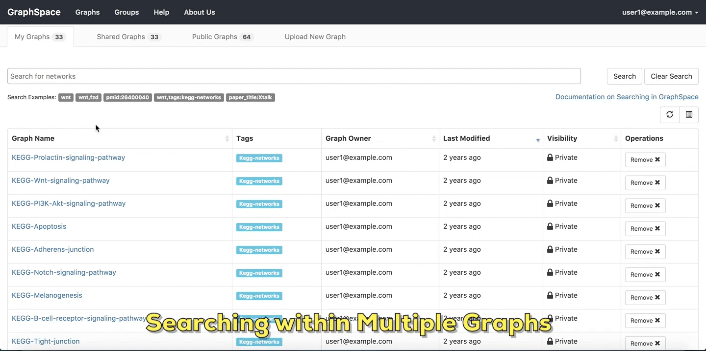

# Searching Graphs

GraphSpace allows the user to search at two different levels. First, the user may visit the Graphs page and search for all graphs (owned by or shared with the user or public) that match the query. Second, the user may visit a specific graph to find nodes and edges within it that match a query.

## Query Semantics

GraphSpace supports simple search semantics:

- **Node** - Provide the node's label or id, e.g., AKT1
- **Edge** - Use the syntax tail:head, where tail is the name of the source node and the head is the name of the target node, e.g., Wnt:Fzd.
- **Multiple nodes/edges** - In order to search for multiple terms, simply seperate each search term with a ",". For example: AKT1, AKT3, CTNNB1.

## Searching within Multiple Graphs

The user can search for graph with a given name or node or an edge on [Graphs Page](http://www.graphspace.org/graphs/) by following the given steps:

1. Enter the name of the graph, node or an edge you are searching for in the search bar.
2. Press `Enter` key or click on the `Search` button.

In this example, the user searches for the list for graphs that contain the protein (node) `CTNNB1` (the symbol for β-catenin, a transcriptional regulator in the Wnt signaling pathway). The reduced list of graphs are the graphs where proteins names/labels (nodes) contain `CTNNB1` as a substring. In the following example, There are six graphs owned by the user and thirty-two public graphs that contain this protein. Each link in the `Graph Name` column will take the user to a specific graph with the search term highlighted. In this example, the user clicks on the graph with the name `KEGG-Wnt-signaling-pathway` and reaches the graph for the Wnt pathway with the searched node highlighted.

## Searching within a Single Graph

The user can search for node or edges within a given graph on [GraphSpace](http://www.graphspace.org/) by following the given steps:

1. Enter the name of the node or an edge you are searching for in the search bar.
2. The nodes or edges are highlighted automatically as you type in the name of the node or edge in the search bar.

In the following example, the user searches for the graph for two proteins (nodes) `CTNNB1` and `WNT` using the query `ctnnb1, wnt`. This search query highlights the proteins where protein (node) name/label contains `CTNNB1` or `WNT` as a substring (case-insensitive). In the following example, the graph contains four nodes which match the given query.

In the following example, the user searches for the graph for edges from `Wnt` to `Fzd` using the query `Wnt:Fzd`. This search query highlights any protein-protien interaction (edge) where tail node name or label contains `Wnt` as a substring and head node name or label contains `Fzd` as a substring. In the following example, the graph contains three edges which match the given query.

## Advanced Search

