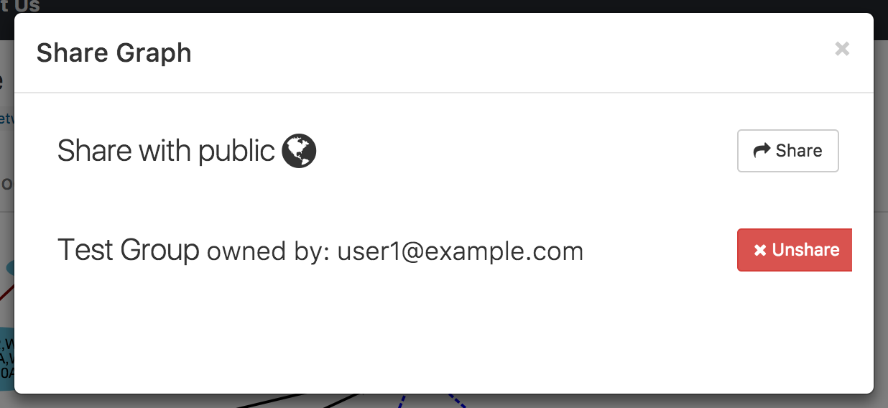

# Sharing Graphs

A user may share a graph and its layouts with groups to which the user belongs.

## Sharing graphs with group(s)
There are two ways to share a specific graph owned by the user: the REST API and the `Share` Button. A user may share a graph with multiple groups. In order to share a graph, the user must own it. In addition, the user must be a member or the owner of the group he/she wants to share the graph with. Sharing a graph allows all the members in the group to access the graph. Un-sharing a graph from a graph means that no one else in the group will be able to access that graph anymore.

This image shows the sharing panel displayed when a user clicks on the `Share` button on the Graph Page. In the following example, the graph is only shared with a group name 'Test Group' created by user1@example.com. The user can click on the Share button next to `Share with public` text to share the graph with everyone.

## Sharing layouts with group(s)
Similar to a graph, a layout may also be shared with a group. In order for a layout to be shared with a group, the graph must already be shared with the group. Currently, the only way to share a layout is through the [Layouts tab](Viewing_Graphs.html#layouts-tab). Initially, only the creator of a saved layout is allowed to access it. Note that a layout may be created by a user who is not the owner of the graph, as long as the layout creator can access the graph (because the owner has shared it). Sharing a layout changes its access as follows:

1. Public graphs

    The layout is also publicly available, i.e., to all users of GraphSpace.
    
2. Shared graphs

    The layout is accessible to every user who is a member of a group with which the graph is shared, as long as the layout creater is also a member of that group.
