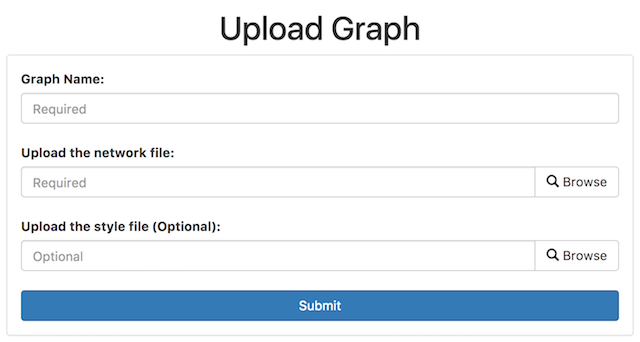

# Uploading Graphs

GraphSpace provides 2 different ways to upload graphs: 

- Via the REST API 
- Via the Web Interface

## Via the REST API

GraphSpace users can also upload graphs using GraphSpace's REST API. Please refer to the Programmer's Guide for more information.

## Via the Web Interface

As an alternative to the REST API for uploading a graph, we provide a [simple web interface](#upload-graph-form) for uploading individual graphs. Once the graph has been uploaded, GraphSpace will provide a unique URL through which the user may interact with the graph represented by the uploaded graph files.

If a user has an account and is logged in, [this interface](#upload-graph-form) will upload the graph directly into the user's account, much like using the REST API. If a user does not have an account or is not logged in, this upload functionality will provide a unique URL through which the user may interact with the graph represented by the uploaded file. **Note: After 30 days, we will delete all graphs that are uploaded for unregistered users of GraphSpace.**


### Upload Graph Form



The upload graph form has three input fields:

#### Graph Name 

The name of the graph. GraphSpace allows users to search graphs by their name. It is a required field. 

#### Network File 

The network file containing the graphs structure and data information in [CYJS Format](Supported_File_Formats.html#cyjs-format). It is a required field.

#### Style File 

The network file containing the graphs style information in [Stylesheet JSON Format](Supported_File_Formats.html#stylesheet-json-format). It is a optional field. If left empty, GraphSpace will use [default style](#default-graph-style) for displaying the graphs.

##### Default Graph Style

GraphSpace uses following default style for all graphs. The default style values are used when:

- The user does not upload a [style file](#style-file) for the graph.
    OR
- The user uploads the style file which doesn't overrides the default style values.

```
[
    {
        'selector': 'edge',
        'style': {
            'curve-style': 'bezier',
            'line-style': 'solid',
            'line-color': 'black'
        }
    },
    {
        'selector': 'node',
        'style': {
            'content': 'data(label)',
            'shape': 'ellipse',
            'background-color': 'yellow',
            'border-color': '#888',
            'text-halign': 'center',
            'text-valign': 'center'
        }
    }
]
```

